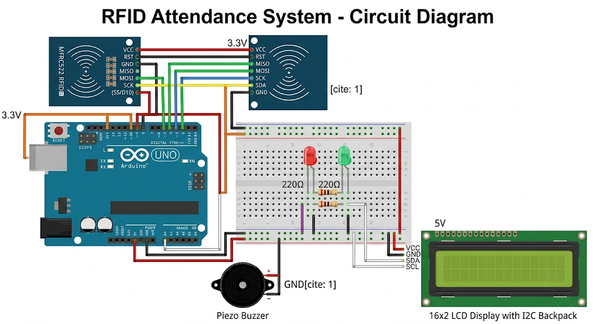

# RFID-Attendance-System

An RFID-based attendance system built with the Arduino Uno utilizing object-oriented C++ programming. This project features secure RFID authentication, non-volatile EEPROM storage for user IDs, runtime enrollment of new cards via the Serial Monitor, and comprehensive visual and auditory feedback mechanisms.

## ✨ Features
*   **Object-Oriented Design:** Clean and modular C++ code encapsulating the system into an `RFIDAttendanceSystem` class[cite: 1].
*   **Persistent Storage:** Saves enrolled student UIDs to the Arduino's built-in EEPROM, meaning data is not lost when the device loses power.
*   **Runtime Enrollment:** Unknown RFID cards automatically trigger a prompt in the Serial Monitor, allowing you to instantly enroll new users by typing 'Y'[cite: 1].
*   **Serial Monitor Commands:** Type `L` or `l` in the Serial Monitor at any time to print a list of all currently enrolled students.
*   **Multi-Sensory Feedback:** Utilizes an I2C LCD screen, a piezo buzzer, and Red/Green LEDs to clearly indicate "Access Granted," "Unknown Card," or "Access Denied" states.
*   **Capacity:** Supports up to 10 unique student cards by default.

## 🛠️ Hardware Requirements
*   1x Arduino Uno
*   1x MFRC522 RFID Reader Module
*   1x 16x2 (or 8x2) LCD Display with I2C Backpack
*   1x Piezo Buzzer
*   1x Green LED
*   1x Red LED
*   2x 220Ω Resistors
*   Breadboard and jumper wires

## 🔌 Circuit & Wiring

### MFRC522 RFID Module (SPI)
| RFID Pin | Arduino Uno Pin | Note |
| :--- | :--- | :--- |
| **SDA / SS** | Digital Pin 10 | Configured in software. |
| **SCK** | Digital Pin 13 | Hardware SPI Clock |
| **MOSI** | Digital Pin 11 | Hardware SPI MOSI |
| **MISO** | Digital Pin 12 | Hardware SPI MISO |
| **RST** | Digital Pin 9 | Configured in software. |
| **3.3V** | 3.3V | **CRITICAL:** Do not use 5V! |
| **GND** | GND | Ground |

### I2C LCD Display
| LCD Pin | Arduino Uno Pin |
| :--- | :--- |
| **SDA** | Analog Pin A4 |
| **SCL** | Analog Pin A5 |
| **VCC** | 5V |
| **GND** | GND |

### Output Indicators
| Component | Arduino Uno Pin | Note |
| :--- | :--- | :--- |
| **Green LED** | Digital Pin 2 | Use 220Ω resistor. |
| **Red LED** | Digital Pin 3 | Use 220Ω resistor. |
| **Buzzer** | Digital Pin 4 | Positive leg to Pin 4. |

## 💻 Software & Libraries
To run this project, you will need the Arduino IDE and the following libraries installed (via the Library Manager):
*   `MFRC522` by GithubCommunity (for the RFID reader)
*   `LiquidCrystal_I2C` by Frank de Brabander (for the LCD)
*   `SPI`, `Wire`, and `EEPROM` (Built-in Arduino libraries)

## 🚀 How to Use
1.  **Clone the Repository:** Download this repository to your local machine.
2.  **Wiring:** Connect the hardware exactly as described in the wiring table above.
3.  **Upload:** Open the `.ino` file in the Arduino IDE and upload it to your Arduino Uno.
4.  **Open Serial Monitor:** Open the Arduino Serial Monitor and set the baud rate to **9600**. 
5.  **Initial Scan:** The LCD will display "Scan Card...". Tap an RFID card/tag.
6.  **Enrollment:** Because the EEPROM is initially empty, the Serial Monitor will prompt you to add the unknown UID[cite: 1]. Type `Y` in the Serial Monitor and press Enter.
7.  **Mark Attendance:** Tap the newly enrolled card again. The Green LED will light up, the buzzer will emit a short beep, and the LCD will display "STUDENT 1 PRESENT".
8.  **List Records:** Type `L` in the Serial Monitor at any time to view all saved student UIDs.

## 📄 License
This project is open-source and available under the [MIT License](LICENSE).
